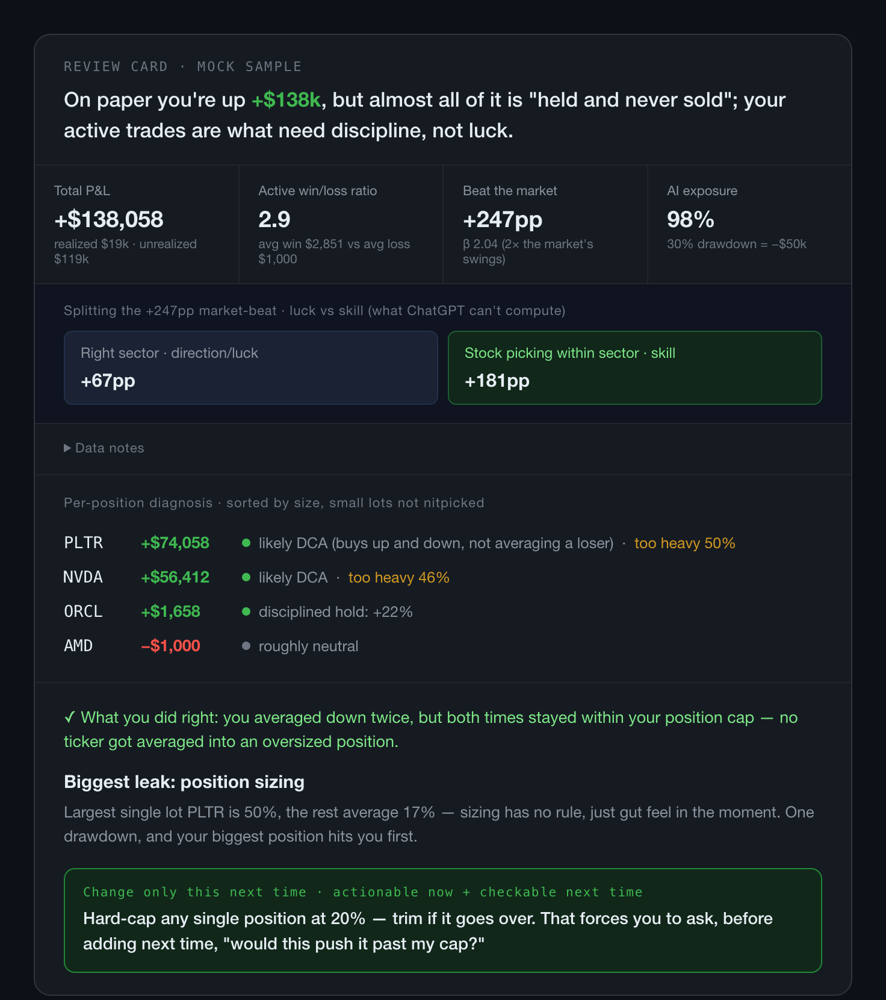

# FOMO Kernel

[](https://www.python.org/downloads/)
[](LICENSE)
[](skills/fomo-kernel)
[](skills/fomo-kernel/engine)

**English** · [繁體中文](README.zh-TW.md) · [简体中文](README.zh-CN.md)

> **A direct, evidence-bound trading decision partner that runs locally.** Bring the trade you are considering or the trades you already made. FOMO Kernel reduces your decision burden without making the decision for you.

It is built for two moments:

- **Before a trade:** see what the trade does to your recorded portfolio, then challenge the reason for doing it now.
- **After trades:** review what your behavior says, then choose one rule worth checking next time.

Numbers, rankings, portfolio effects, and state transitions come from a deterministic Python engine. The agent handles the bounded work code cannot settle: your motive, the strongest counter-case, and a direct explanation of what matters.

## Start from the moment you are in

| Your moment | Minimum input | First useful outcome |
|---|---|---|
| **“Should I buy, add, trim, or wait?”** | The contemplated action, your current reason, and what changed now | With a recorded portfolio: exact post-trade weight, hidden overlap/concentration, cash effect, rule collisions, the key trade-off, and the strongest counter-case. |
| **Same decision, but no portfolio recorded yet** | Your decision, reason, and why now | A bounded decision framing instead of a refusal: strongest case, strongest counter-case, the question the decision turns on, and a clear statement of what was not checked. No invented portfolio numbers and nothing is persisted. |
| **“Review my recent trades.”** | A broker CSV or transaction export | One focused behavior-review card: what you did right, your largest supported leak, the motive question that changes the read, and at most one rule you choose. |
| **“I only have a holdings screenshot.”** | A position table or statement screenshot | An opening structural check: weights, single-position risk, driver concentration, ETF structure, and data-integrity limits. It does not invent transaction history. |
| **“Show me the experience first.”** | No personal data | An isolated test drive using fictional data. It never writes to your real coach memory. |

## What using FOMO Kernel feels like

### 1. Start in plain language

You do not choose an internal mode or learn a workflow first. State the decision you are facing, attach the record you have, or ask for a test drive.

FOMO Kernel uses the narrowest useful path for that moment. A live decision stays a concise conversation. A transaction review earns a card. A holdings screenshot gets a structural check instead of historical claims it cannot support.

### 2. The engine establishes the facts before the agent interprets them

The engine owns portfolio math, ranking, rule collisions, identity, and durable state. The agent cannot quietly replace a missing price, recalculate a weight, or invent a trade history.

That gives the conversation a stable footing: what the record says, what the agent thinks it means, and what remains unknown stay distinguishable.

### 3. It asks only what code cannot know

A suspicious add can be conviction or refusal to cut a loser. An early exit can be discipline or fear of giving back a gain. Code can identify the tension; only you can settle the motive.

The questions therefore focus on why now, what changed, what would prove the thesis wrong, or what actually drove the action. They are not a generic investor-profile questionnaire.

### 4. You see the useful result before making another commitment

A pre-trade answer leads with the decision-relevant tension and strongest rebuttal, not with tool narration or a wall of caveats.

A review shows the complete card in the conversation before asking you to choose a rule. A generated file is not treated as delivery; the result has to reach you.

### 5. You keep the final action

For a contemplated trade, FOMO Kernel can record what was considered, but never calls it executed. It does not issue a price target or decide which ticker to buy or sell.

For a review, you may choose one proposed rule, write your own, or skip. The product does not manufacture a commitment merely to complete the flow.

### 6. The next conversation starts from the last one

On a later review, FOMO Kernel first checks the rule you chose and carries forward confirmed theses and the recorded portfolio. Re-uploading full transaction history is safe because overlapping rows are deduplicated. A newer holdings view is compared with the recorded portfolio instead of silently replacing it.

The value is not a larger archive. It is continuity: **what you believed → what you did → what changed → what deserves to survive as a rule.**

## What it looks like

The committed demo uses fictional data. The detailed text version stays collapsed so the product journey remains the first thing a new reader sees, while its values remain synchronized with the HTML and image assets.

<details>
<summary>Open the illustrative review card</summary>

```text
Review card · mock sample
On paper you're up +$138k, but almost all of it is "held and never sold";
your active trades are what need discipline, not luck.

  Total P&L             +$138,058    (realized $19k + unrealized $119k)
  Active win/loss ratio  2.9         (avg win $2,851 vs avg loss $1,000)
  Beat the market +247pp · β 2.04 · AI exposure 98% (30% drawdown = −$50k)
      └ splitting "beat the market" into luck vs skill: right sector +67pp + picking within the sector +181pp

  Data notes:
  - the α interval is still wide — can't yet tell skill from luck; don't take the demo literally.

Per-position diagnosis (sorted by size; small lots not nitpicked):
  PLTR  +$74,058   [v] likely DCA (buys up and down, not averaging a loser) · [!] too heavy 50%
  NVDA  +$56,412   [v] likely DCA · [!] too heavy 46%
  ORCL   +$1,658   [v] disciplined hold: +22%
  AMD    -$1,000   --  roughly neutral

[v] What you did right: you averaged down twice, but both times stayed within your position cap — no ticker got averaged into an oversized position
[X] Biggest leak: position sizing — largest single lot PLTR is 50%, the rest average 17%
[*] Change only this next time: hard-cap any single position at 20% — trim if it goes over
```

</details>



Open the synchronized [English HTML demo](docs/demo-card-en.html) or [Traditional Chinese HTML demo](docs/demo-card.html).

The image shows the result card. In the real review flow, the motive question comes first, and your answer can change the verdict. The mock is intentionally concentrated; its alpha figures are not a realistic performance claim.

Pre-trade answers stay brief and textual unless you explicitly ask for more.

## Fastest path to value

### 1. Install

```bash
git clone https://github.com/atomchung/fomo-kernel
cd fomo-kernel

python3 -m venv .venv
source .venv/bin/activate
pip install -r requirements.txt

python3 skills/fomo-kernel/engine/review.py doctor
mkdir -p ~/.claude/skills
ln -s "$(pwd)/skills/fomo-kernel" ~/.claude/skills/fomo-kernel
```

Launch Claude Code from a terminal where the virtual environment is active.

### 2. Bring one real decision or one real record

Inside Claude Code:

```text
/fomo-kernel I'm considering adding 20 shares of NVDA.
My current reason is ..., and what changed now is ...

/fomo-kernel ~/Downloads/trades.csv

/fomo-kernel
Then attach a holdings table or statement screenshot.

/fomo-kernel
With no file, choose the fictional test drive.
```

You do not need to clean a broker export by hand. The agent maps it locally into the engine contract.

Questions and cards support English, Traditional Chinese, and Simplified Chinese (`--language en|zh-TW|zh-CN`). Language changes the copy, not the engine facts.

## What each input can support

### A contemplated trade with a recorded portfolio

FOMO Kernel computes the resulting position weight, concentration and overlap between positions that depend on the same driver, cash effect, rule collisions, and the portfolio basis behind those facts. The answer then argues the strongest case and strongest counter-case from that frozen result.

### A contemplated trade without a recorded portfolio

The conversation still advances, but it does not pretend to know weight, concentration, cash, or rule collisions. It asks only the few questions that change the framing and names the next piece of evidence that would buy a more specific answer. Nothing from this path is persisted.

### Transaction history

A transaction export can support behavior over time: sizing, averaging, exits, diversification, holding consistency, per-position diagnosis, and supported performance attribution. The engine narrows the few motives worth asking about; the finished review converges on one card and at most one user-chosen rule.

### A holdings snapshot

A position table or screenshot can support an opening structural check. It cannot honestly reveal prior averaging down, exit discipline, holding behavior, win rate, payoff, alpha, or historical motive. Add transaction history later to unlock those claims.

## Why this is different from ordinary chat

A general chat can discuss a thesis. FOMO Kernel adds an enforced decision contract:

| Layer | Owner |
|---|---|
| Portfolio math, rankings, rules, identities, and state transitions | Deterministic engine |
| Motive questions, bounded interpretation, strongest counter-case, plain-language explanation | Agent |
| Final action, confirmation, and whether a rule should be kept | User |
| Durable history and replay | Local canonical session bundles |

That separation prevents the agent from quietly becoming a second source of portfolio truth.

## Privacy and truth boundaries

- **No FOMO Kernel backend.** The repository has no account service or upload endpoint, and nothing is sent to the author.
- **Local files and state.** Source files, normalized snapshots, canonical sessions, private cards, and projections live on the machine running the skill.
- **Public market data.** To calculate supported prices and returns, the engine may query public symbols and dates from market-data providers. It does not send broker rows, quantities, costs, motives, or cards.
- **Your AI host still matters.** The model/client you choose may process content you explicitly provide under that host's own terms. FOMO Kernel does not add another server or silently publish the data.
- **No cloud OCR path.** A screenshot is transcribed by the coding agent from the local attachment; the engine does not upload it to an OCR service.
- **Private by default.** `card-private.*` is the normal output. Ask for a share-safe version to receive `card-public.md`, which removes amounts, dates, tickers, exact weights, session IDs, and agent free text. Nothing is published automatically.
- **Public repository evidence is synthetic only.** Never post real trades, holdings, motives, or cards to a public issue or PR.

## Local memory, repeat use, and recovery

Completed reviews are stored as immutable canonical sessions:

```bash
ls ~/.trade-coach/sessions/
```

Useful controls:

```bash
python3 skills/fomo-kernel/engine/coach.py data-status
python3 skills/fomo-kernel/engine/coach.py data-export --out backup.zip
python3 skills/fomo-kernel/engine/coach.py data-reset --dry-run
python3 skills/fomo-kernel/engine/coach.py data-reset --confirm
```

`data-status` reports file metadata, not trade content. Treat an exported backup like a brokerage statement; `data-reset --confirm` is irreversible.

After an interruption, the agent resumes the pending session instead of refetching facts you already answered against. If a canonical session committed but a derived projection failed, the projection can be rebuilt without re-questioning you.

## Other coding agents

Claude Code provides the simplest slash-command installation. Codex, Cursor, and compatible coding agents can use the same host-neutral contract by opening the repository and following [`AGENTS.md`](AGENTS.md), which routes to [`skills/fomo-kernel/SKILL.md`](skills/fomo-kernel/SKILL.md).

For a host-neutral test-drive plan:

```bash
python3 skills/fomo-kernel/engine/review.py prepare --test-drive --language en
```

This command returns a Review Plan; the agent follows its selected flow to present and complete the experience.

Current owner-live acceptance focuses on Claude Code and Codex. A compatible client is not automatically an accepted client.

## Platform support

- Python 3.11+.
- macOS and Linux support durable session finalization.
- Windows can run `prepare` and `preview`, but durable `finalize` currently fails closed before committed canonical state is changed because the implementation requires POSIX locking and directory `fsync`.

## What FOMO Kernel is not

FOMO Kernel does not:

- issue price targets or market forecasts;
- select stocks for you;
- make or execute the final buy/sell decision;
- become a broker, wealth manager, or full investment operating system;
- crawl or mirror your private research repository;
- replace missing portfolio facts with generic advice.

It is research and decision-coaching support, not investment advice. You remain responsible for every investment decision and outcome.

## For contributors and maintainers

Start with:

- [`AGENTS.md`](AGENTS.md) — routing and non-negotiable boundaries;
- [`docs/issue-lifecycle.md`](docs/issue-lifecycle.md) — current-context loading and issue ownership;
- [`docs/maintainer-guide.md`](docs/maintainer-guide.md) — development, privacy, tests, mirrored surfaces, and PR conventions.

Before committing repository changes:

```bash
python3 tests/run_all.py
```

The public examples and fixtures must remain synthetic. See the [MIT License](LICENSE).