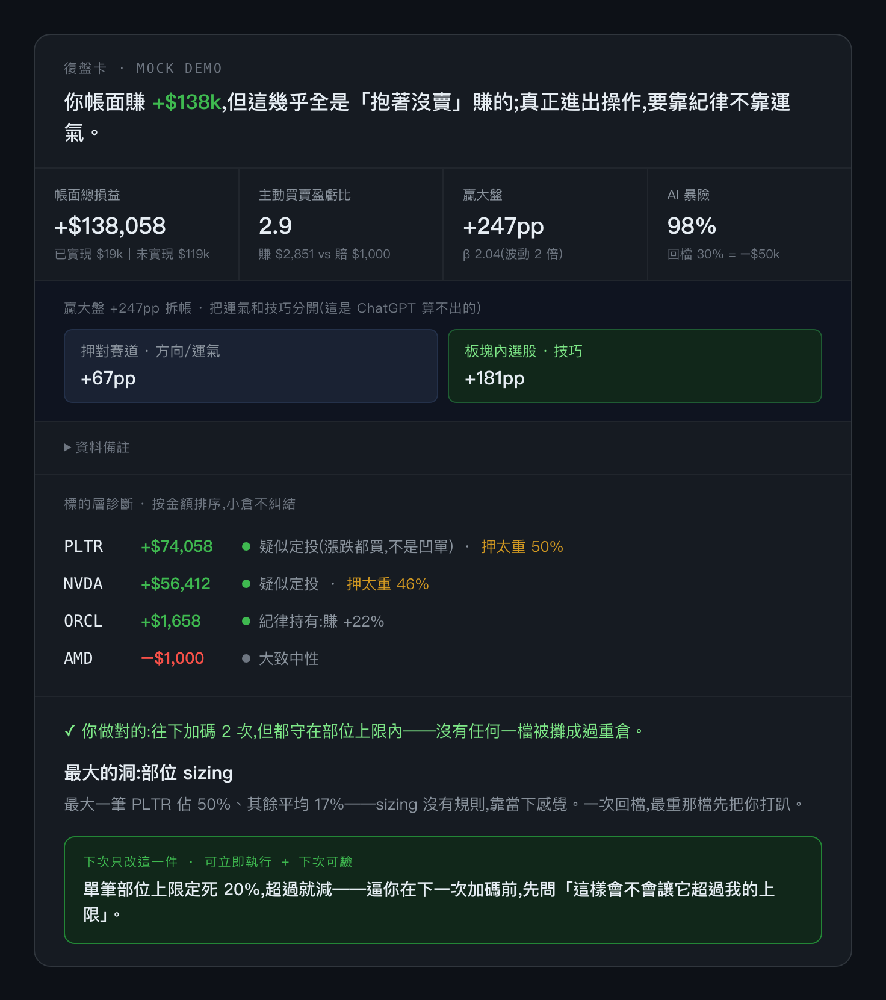

# FOMO Kernel

[English](README.md) · **繁體中文**

> 一個給 Claude Code、Codex、Cursor 等 coding agent 使用的本機交易復盤 skill：先用確定性診斷找出行為漏洞，再透過一段判斷對話收斂成**一張卡**——
> 你做對的一件事 + 一個最大的洞(用你自己的數字)+ 一條你親選、下次可驗的規矩。下次復盤會先對帳這條規矩有沒有守。

不是又一份統計報表。它做的是報表做不到的事:**先算出你看不見的行為漏洞,再問出你不願承認的動機,最後收斂到你親選的一個可驗改變,下次復盤再回來對帳。**


## Quick start

**完整流程(這才是產品本體)—— 在 Claude Code 裡:**
```
/fomo-kernel ~/Downloads/my.csv   # 復盤你自己的交易(任何券商 CSV)
/fomo-kernel <附上的持倉表或對帳單截圖>   # 第一次持倉健檢
/fomo-kernel                      # 沒給資料 → 會請你提供,或用內建假資料「試駕」一遍(不寫入教練記憶)
```
卡的價值在第 ② 步那段對話 —— 引擎挑出可疑標的、問你「逢低還是凹單?」,你一句話定案,卡才出定論。**光看引擎原始輸出看不到這層。** 安裝見下方 [安裝](#安裝)。

持倉表或截圖會走更窄的 snapshot route：只做第一次持倉健檢，談成本或市值權重、單一部位風險、driver 集中、ETF 結構與資料完整性。單張快照看不出過去是否攤平、怎麼出場、持有行為、勝率、盈虧比、alpha 或歷史動機；之後補交易紀錄，才解鎖有證據支持的歷史診斷，但不會因此宣稱已對上最新券商畫面，當前持倉仍以 ledger 推導結果為準。

**想先零安裝、看穩定流程怎麼開始**：
```bash
git clone https://github.com/atomchung/fomo-kernel && cd fomo-kernel
pip install -r requirements.txt      # 若報 externally-managed-environment → 見下方「安裝」的 venv 三行
cd skills/fomo-kernel && python3 engine/review.py prepare --test-drive --language zh-TW
# 先產生可恢復的 Review Plan；required questions 問完才 preview/finalize
```

## 跑出來長什麼樣

跑內建 mock 的**示意卡**長這樣(下面是簡化速覽版;實際引擎輸出是彩色終端卡,另含 what-if 回檔壓測、5 維行為 bar、報酬拆帳專區——真正的定論卡則是 Claude 在 Step ② 對話問完動機後才收斂的):

```text
復盤卡 · mock 範例
你帳面賺 +$138k,但幾乎全是「抱著沒賣」賺的;真正進出操作,要靠紀律不靠運氣。

  帳面總損益      +$138,058    (已實現 $19k + 未實現 $119k)
  主動買賣盈虧比   2.9          (平均賺 $2,851 vs 賠 $1,000)
  贏大盤 +247pp · β 2.04 · AI 暴險 98%(回檔 30% = −$50k)
      └ 把「贏大盤」拆成運氣和技巧:押對賽道 +67pp + 板塊內選股 +181pp

  資料備註:
  - α 區間仍寬,還分不出選股是本事還是運氣 —— demo 別當真。

標的層診斷(按金額排序,小倉不糾結):
  PLTR  +$74,058   [v] 疑似定投(漲跌都買,不是凹單) · [!] 押太重 50%
  NVDA  +$56,412   [v] 疑似定投 · [!] 押太重 46%
  ORCL   +$1,658   [v] 紀律持有:賺 +22%
  AMD    -$1,000   --  大致中性

[v] 你做對的:往下加碼 2 次,但都守在部位上限內,沒有任何一檔越攤越重
[X] 最大的洞:部位 sizing — 最大一筆 PLTR 佔 50%,其餘平均 17%
[*] 下次只改:單筆部位上限定死 20%,超過就減
```

同步的深色卡片示意可見 [English HTML](docs/demo-card-en.html) 與 [繁體中文 HTML](docs/demo-card.html)。



> 真實使用時,引擎還會挑出「金額大 + 虧損中狂加碼」的標的,在**出卡前**先問你「這是逢低還是凹單?」——機械分不出的動機,你一句話定案,卡才出定論。
> ⚠️ mock 的 α 數字會失真(持倉太集中、橫截面太窄),別當真;真實多元持倉才看 α。

---

## 它跟「貼對帳單給 ChatGPT」差在哪

ChatGPT 算不出 FIFO 配對的真實 α/β、分不清你是「定投」還是「凹單」、也沒有你的歷史。這個 skill 三層遞進:

1. **機械層(Python,確定性精算)** — 算 ChatGPT 估不準的東西:
   - 5 維行為診斷:部位 sizing / 加碼攤平 / 出場 / 分散 / 持有一致性
   - **標的層診斷**:按**金額**排序每檔(小倉不糾結),主從分類器分「疑似定投 vs 疑似凹單 vs 待確認」
   - **報酬歸因**:把「贏大盤」拆成「押對賽道(運氣/方向)」vs「選股(技巧)」——讓你看清賺的是本事還是膽子
2. **判斷對話層(引擎訊號 × 你的意圖)** — 機械分不出的「為什麼」,出卡前問你:
   - 持股假設:「MSTR 一路加碼還虧,是還相信 thesis,還是不想認賠在凹單?」
   - 動機:「賣掉賺錢的賣太早,是 thesis 到價,還是怕回吐?」
   - **機械挑該問的少數標的,你的答案定性**——機械永遠在猜,你一句話定案
3. **單一規矩層** — 把定性收斂成少數候選規矩。你可選一條、自訂一條或跳過；下次復盤會沿用同一條規矩對帳，不從零開始。

→ 最後收斂成**一張卡**,一個洞、一條下次能驗的規矩。第二次來,先對帳「上次那條守了沒」。

## 🔒 隱私:不上傳後端、作者拿不到

- skill 在**你自己的機器**上跑你的 CSV 或標準化持倉快照,**不上傳到任何後端、不落地儲存到別處、不回傳給作者**。為了每週對帳,它會把復盤衍生的狀態存在**你本機**的 `~/.trade-coach/`(永不外傳)——下一節說明那是什麼、怎麼查看、匯出或清除。
- 作者拿不到你的交易明細。唯一(自願)回收的是一句「這張卡有沒有用」,不含交易內容——願意給的話走 [card feedback 表單](https://github.com/atomchung/fomo-kernel/issues/new?template=card-feedback.yml),30 秒。
- `.gitignore` 已設:**任何 `.csv` 都不會被 commit**,只有 mock/sample 假資料例外。
- 精確說：本機 Python engine 讀標準化後的交易 CSV 或 snapshot JSON envelope。你使用的 coding agent 可能在本機讀持倉表或截圖，把券商已顯示的事實逐欄轉錄；不走 engine OCR，也沒有雲端 OCR／上傳路徑。暫存 JSON 會放在 repo 外（例如 `/tmp`），agent 更不會自行計算權重或手組 card/state。資料不回作者。這跟把對帳單交給一個會保留資料、你看不到的 SaaS 是兩回事。

## 📁 你的教練記憶在哪 / 怎麼維護

第二次來，卡會先對帳「上次那條規矩守了沒」。每次正式復盤的權威紀錄是一個 immutable canonical session：

```bash
ls ~/.trade-coach/sessions/       # bundle、state、answers、cards、hash manifest
```

原本的本機檔仍保留，但它們是可重建的相容 projection：

```bash
cat ~/.trade-coach/log.jsonl       # 每行一次復盤(薄 metric + 你承諾的規矩);空 = 第一次
cat ~/.trade-coach/theses.jsonl    # 每筆持倉的「為什麼持有 + 什麼條件算錯」(append-only,不覆蓋)
cat ~/.trade-coach/profile.md      # 你的交易目標 + 3 條個人原則(復盤對照基準)
cat ~/.trade-coach/last_state.json # 最近一次引擎算出的薄狀態(含各持倉 shares/cost,對帳用;每次跑覆蓋)
```

引擎在那裡還放了幾個衍生檔(交易帳本、出場追蹤佇列、問題/規矩記錄、你存下來的復盤卡)——與其靠一份散文清單保證完整,下面這組 CLI 才是「本機到底存了什麼」的單一事實源:

```bash
python3 skills/fomo-kernel/engine/coach.py data-status               # 每個已知路徑:存在嗎?多大?幾行?(不印交易內容本身)
python3 skills/fomo-kernel/engine/coach.py data-export --out backup.zip   # 把現有資料打包成一個 zip(內含敏感交易衍生資料,請比照對帳單保存)
python3 skills/fomo-kernel/engine/coach.py data-reset --dry-run      # 預覽 reset 會刪什麼
python3 skills/fomo-kernel/engine/coach.py data-reset --confirm      # 真的全部刪除(不可復原)
```

- **下週回來要匯哪份 CSV?** 直接把**全歷史**再匯出來丟給它就好——你不用手動追增量。跟之前重疊的列會自動去重(去重就是為這個設計的),所以**每週丟整份對帳單都安全**;引擎用上次復盤的截點判斷哪些是新的,卡第一句就對帳你上次承諾的那條規矩。
- **snapshot 會錨定什麼？** 完整的第一次 snapshot 可以成為 ledger 的會計錨點；不完整 snapshot 仍可產出有邊界的健檢，但不寫成錨點。之後補交易檔可解鎖有證據支持的歷史分析，當前持倉仍以 ledger 推導結果為準。第二次或後續 snapshot 的差異比對、對帳與 adjustment event 明確留在 P1；需要這層對帳才能成立的當前畫面說法維持不可用。
- **看歷次復盤** → `cat ~/.trade-coach/log.jsonl`。
- **重新開始 / 清空對帳基準** → `coach.py data-reset --confirm`(或自己刪掉/改名 `~/.trade-coach/`,效果一樣:下次就當第一次)。
- **thesis 寫歪了** → 在下一次復盤新增修訂 event，指回舊 thesis；不要直接手改 `theses.jsonl`，它現在是 canonical session 的可重建 projection。
- **隱私自證**:教練記憶就是 `data-status` 列出的那些檔、全在你機器上,作者那邊一行都沒有。
- **想先看「多週迴圈」長什麼樣**(全程在 temp 目錄跑,**不碰**你正式的 `~/.trade-coach/`) → `python3 skills/fomo-kernel/engine/demo_weeks.py`:把內建 mock 按時間切 3 段模擬「初診 → 對帳 → 對帳」,直接看到第二張卡怎麼引用上週承諾、log.jsonl 怎麼一行行長出來。

> 💡 **想分享給社群？** 每個 committed review 都會另外產生 `card-public.md`。它不是遮罩復盤卡，而是重新渲染：交易紀錄復盤可保留去敏後的行為模式、引擎計算的 beta 與相對大盤百分點；snapshot review 只保留固定的結構基線說法，不暗示歷史行為。兩者都移除金額、日期、ticker、精確權重與 agent 自由文字；回覆仍預設給復盤卡。目前只有本機檔案，尚未提供上傳或發布功能。

## 安裝

**前置：**Python 3.11+。耐久化 session finalize 目前需要 POSIX `flock` 與目錄 `fsync`（macOS/Linux）；Windows 會在 canonical session storage 寫入前以受控 CLI 錯誤 fail closed。Claude Code 使用者可安裝下面的 slash-command skill；Codex、Cursor 等 agent 可直接依 `AGENTS.md` 與 `engine/review.py` 使用 repo，不需要 Claude 訂閱。

需要 Python 3.11+。**新 macOS(Homebrew / 系統 Python)直接 `pip install` 會被 PEP 668 擋下**(`externally-managed-environment`),用 venv 三行裝:
```bash
python3 -m venv .venv && source .venv/bin/activate
pip install -r requirements.txt                            # yfinance + pandas + rich
python3 -c "import yfinance, pandas, rich; print('ok')"    # 驗證:印出 ok 才算裝好
```
把 skill 掛進 Claude Code(二選一):
```bash
ln -s "$(pwd)/skills/fomo-kernel" ~/.claude/skills/fomo-kernel   # A. symlink(推薦)
cp -r skills/fomo-kernel ~/.claude/skills/                         # B. 複製(給別人用)
```
> ⚠️ 用 venv 裝的話,之後 Claude Code 跑引擎時要吃得到這些依賴:在**啟用了 venv 的終端**開 `claude`,或引擎報 `ModuleNotFoundError` 時把 `python3` 換成 `.venv/bin/python3` 重跑(SKILL 內建這個補救指引)。

## 用法

在 Claude Code 裡:
```
/fomo-kernel ~/Downloads/my.csv   # 交易紀錄復盤
/fomo-kernel <附上的持倉表或對帳單截圖>   # 第一次持倉健檢
/fomo-kernel                      # 沒給資料 → 會請你提供,或用內建假資料「試駕」走完四步(標示範、不寫入教練記憶)
```
你的 CSV 來自**任何券商**都行——Claude 會自動讀懂、轉成引擎要的欄位(`Symbol / Action(BUY|SELL) / Quantity / Price / TradeDate`,台股等非美股可加選填欄 `Market / Currency`,如 `2330.TW / TW / TWD`;不填 = 美股 USD),不必你手動整理。

持倉表或截圖則由 agent 在本機把畫面上的事實轉成標準 JSON envelope（`as_of`、`positions`，以及選填的現金、匯率與完整性事實），把暫存檔放在 repo 外，再交給 `review.py`。權重、cycle ID、風險 metric 與 ETF 定性都由引擎計算，不由 agent 手算。第一次 snapshot 會為尚未覆蓋的持倉建立 inferred thesis；只有完整的第一次 snapshot 可以成為會計錨點。之後補交易紀錄可解鎖有證據支持的歷史行為診斷，但不會宣稱 ledger 持倉已對上更新的券商畫面。

> 🏷️ **冷門標的**可由 agent 提出本機 driver map；冷門 ETF 另可提出 instrument map。但只有明確分類為大盤、區域、債券或商品 ETF 才取得配置豁免；未知標的預設仍算集中風險。

**會發生什麼**：① `prepare` 跑確定性診斷並建立 question queue → ② agent 問完所有回傳問題並建立必要的 inferred thesis（snapshot 可以沒有動機問題）→ ③ `preview` 驗證 artifacts 並產卡 → ④ 你最多選一條規矩，也可以跳過，再由 `finalize` 原子提交整個 session。

## 其他 coding agent 怎麼用

沒有 Claude Code 的 skill 系統一樣能用。Codex、Cursor 等 agent 走同一份 orchestration contract：

```bash
cd skills/fomo-kernel
python3 engine/review.py prepare ~/Downloads/my.csv --language zh-TW
python3 engine/review.py prepare --route snapshot_review \
  --snapshot-json /tmp/fomo-kernel-positions.json --language zh-TW
# 依 review_plan.flow_path 執行，回答 question_queue，再呼叫 preview / finalize
```

叫 agent 先讀 [`AGENTS.md`](AGENTS.md)。`SKILL.md` 現在是薄入口；各 mode 的 flow、JSON schema、validator 與 renderer 才是詳細契約。

## 風格 sample(直接可跑,看不同風格照出不同洞)

`mock/` 下有 **12 組 sample**(3 組散戶風格基準 + 4 組投資者畫像擴充 + 5 組 engine 邊界情境)外加 `mock_trades`,各觸發一種典型洞或 engine 邊界。下面列 4 個代表,完整 12 組與設計意圖見 [`mock/SAMPLES.md`](skills/fomo-kernel/mock/SAMPLES.md):

```bash
cd skills/fomo-kernel
TR_DRIVER_MAP=mock/sample_fundamental.driver_map.json python3 engine/trade_recap.py mock/sample_fundamental.csv
TR_DRIVER_MAP=mock/sample_momentum.driver_map.json    python3 engine/trade_recap.py mock/sample_momentum.csv
TR_DRIVER_MAP=mock/sample_value.driver_map.json       python3 engine/trade_recap.py mock/sample_value.csv
python3 engine/trade_recap.py                          # 不帶參數 = mock_trades.csv
```

| sample | 風格 | 該照出的頭號洞 |
|---|---|---|
| `sample_fundamental` | 基本面選股 | 出場紀律(賺錢抱 120 天就跑、賠錢抱 378 天等回本) |
| `sample_momentum` | 動能衝衝衝 | 部位梭哈 + 假分散(把 beta 當 alpha) |
| `sample_value` | 只買便宜 | 加碼攤平(越跌越凹,把 INTC 凹成單一重倉) |
| `mock_trades` | 方法論建立期 | FOMO 全 AI 假分散 + PLTR 攤平 |

> 另有 4 組投資者畫像擴充(`sample_ai_holder` / `sample_oldecon` / `sample_swing` / `sample_day_trader`,從長抱一年半的 AI 信徒到同日進出的當沖客)——跑法與設計見 [`mock/SAMPLES.md`](skills/fomo-kernel/mock/SAMPLES.md)。
> ⚠️ 引擎用 yfinance 抓真實歷史價算 α/β、市值、套牢,**重跑時絕對數字會隨當前股價漂移**;但每組設計觸發的頭號洞是穩定的(由交易行為決定,不靠特定股價)。

## 結構

```
skills/fomo-kernel/
  SKILL.md                  ← 薄入口與不可違反的 invariants
  flows/                    ← first / weekly / snapshot / test-drive 路由契約
  references/               ← agent 邊界、thesis、卡片與 recovery policy
  schemas/                  ← Review Plan / answers / narrative / canonical bundle
  copy/                     ← 繁中與英文產品 copy
  engine/review.py          ← prepare / preview / finalize / resume
  engine/session.py         ← atomic canonical bundle + legacy projections
  engine/card_renderer.py   ← deterministic private/public Markdown + HTML
  engine/instruments.py     ← ETF 配置／集中風險 policy
  card-spec.md              ← Step 3 卡規格(禁止清單 / redact / 敘事鐵律;Step 2 問完才讀)
  engine/trade_recap.py     ← 機械層:5 維 + 標的層主從分類 + 歸因(純函式,無真實路徑)
  rubric/
    vincent-yu.md           ← release 後研究筆記:意譯原則 + 來源清單;現行 v2 不讀取
    vincent-yu.lens.json    ← release 後研究用 schema 資產;未接入現行 v2 問句或卡片
  behavior-diagnosis.md     ← 診斷哲學:對事不對人、行為多標籤(why 的設計記錄)
  card-template.html        ← 復盤卡 HTML 版型範例
  mock/                     ← 12 組 sample + mock_trades + 各自 driver map + SAMPLES.md
```

## 免責

`rubric/` 內是從公開文章蒸餾的 release 後研究資產。內容採意譯摘要並附來源清單，非逐字引述、非轉載、非經本人背書；現行 v2 也不會把它們載入成 runtime persona。
本工具定位 **research / coaching support**,所有輸出僅為交易行為回顧與紀律建議,**不構成投資建議、不涉及任何標的買賣推薦**;最終投資決策與結果由使用者自負。
程式碼以 [MIT License](LICENSE) 授權;`rubric/` 內的意譯研究內容附來源清單,不隨 MIT 轉授權。
