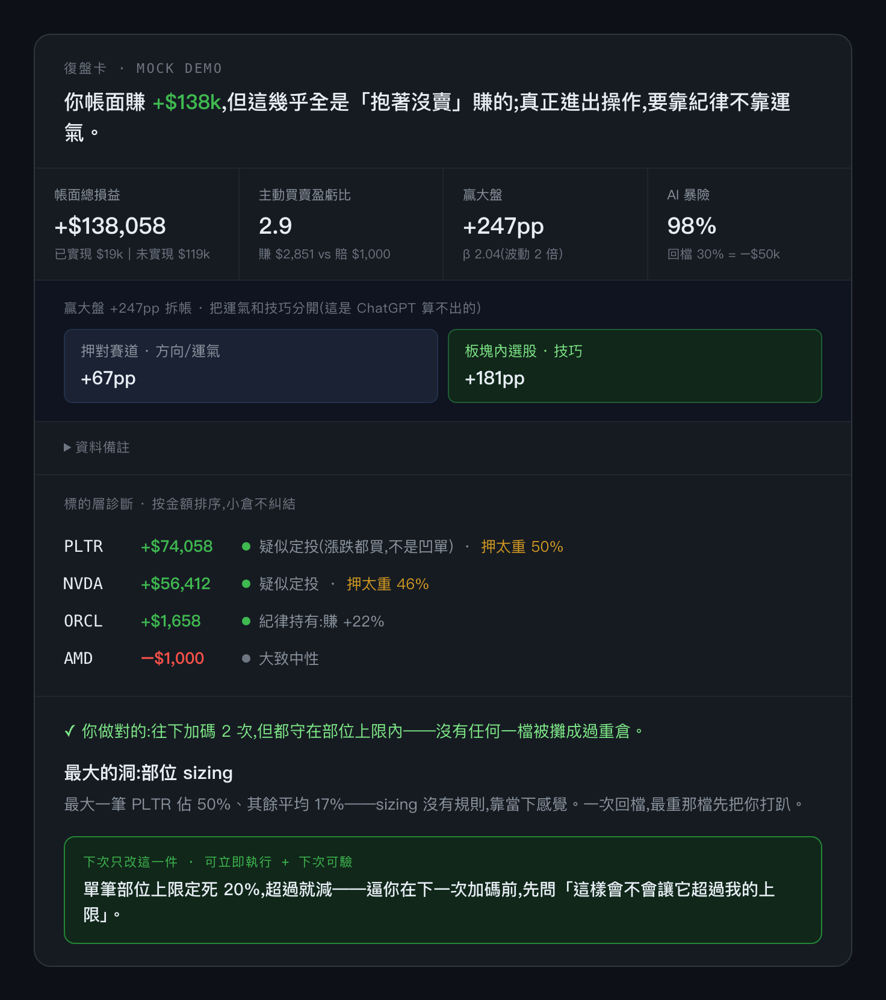

# FOMO Kernel

[](https://www.python.org/downloads/)
[](LICENSE)
[](skills/fomo-kernel)
[](skills/fomo-kernel/engine)

[English](README.md) · **繁體中文** · [简体中文](README.zh-CN.md)

> **一個本機、以證據為界的交易決策夥伴。** 把你正在考慮的交易，或已經做過的交易帶進來。FOMO Kernel 會降低你的決策負擔，但不替你做最後決定。

它服務兩個核心時刻：

- **交易前：** 把你準備做的事，放回真實記錄的持倉裡挑戰。
- **交易後：** 從行為找出最值得處理的一件事，親自選一條下次可驗的規則。

數字、排名、組合影響與狀態轉換由確定性 Python 引擎負責。Agent 只處理程式無法替你決定的有限判斷：你的動機、最強反方論點，以及直接說清楚「現在真正重要的是什麼」。

## 從你現在的時刻開始

| 你現在遇到的事 | 最少需要提供 | 第一個有用結果 |
|---|---|---|
| **「我該買、加碼、減碼，還是先不動？」** | 預計動作、目前理由，以及現在有什麼改變 | 已有記錄持倉時：精確的交易後權重、集中度／驅動重疊、現金影響、規則衝突、一個主要決策張力與真正的反駁。 |
| **同一個決策，但還沒有記錄持倉** | 決策、理由與為什麼是現在 | 不會直接拒絕，而是給一個有邊界的決策框架：最強正方、最強反方、真正需要回答的關鍵問題，以及哪些組合事實尚未檢查。沒有虛構數字，預設也不持久化。 |
| **「幫我復盤最近的交易。」** | 券商 CSV 或交易匯出 | 一張聚焦的行為復盤卡：做對的一件事、最大且有證據的漏洞、會改變判讀的動機問題，以及最多一條你親自選的規則。 |
| **「我只有持倉截圖。」** | 持倉表或券商對帳單截圖 | 開場結構檢查：權重、單一持倉風險、驅動集中、ETF 結構與資料完整性限制。不虛構交易歷史。 |
| **「先讓我看看體驗。」** | 不需要私人資料 | 使用虛構資料的隔離 test drive，不會寫進你的真實教練記憶。 |

## 最快得到價值的路徑

### 1. 安裝

```bash
git clone https://github.com/atomchung/fomo-kernel
cd fomo-kernel

python3 -m venv .venv
source .venv/bin/activate
pip install -r requirements.txt

python3 skills/fomo-kernel/engine/review.py doctor
mkdir -p ~/.claude/skills
ln -s "$(pwd)/skills/fomo-kernel" ~/.claude/skills/fomo-kernel
```

請從已啟用虛擬環境的終端機啟動 Claude Code。

### 2. 帶進一個真實決策，或一份真實記錄

在 Claude Code 裡：

```text
/fomo-kernel 我正在考慮加碼 20 股 NVDA。
我現在的理由是……，而這次真正改變的是……

/fomo-kernel ~/Downloads/trades.csv

/fomo-kernel
接著附上持倉表或券商對帳單截圖。

/fomo-kernel
沒有檔案時，選擇虛構資料 test drive。
```

你不需要自己清理券商匯出。Agent 會在本機把它映射成引擎需要的資料契約。

## 產品實際會做什麼

### 交易前：挑戰決策，不是評論 ticker

當已有記錄持倉時，FOMO Kernel 會在 Agent 論證前先計算這筆預計交易的後果：

- 交易後持倉權重；
- 集中度與驅動重疊；
- 現金影響；
- 與既有個人規則的衝突；
- 上述事實使用的組合基礎與限制。

回答會先講一個有證據的主要決策張力，再給最強反方，並把限制貼在它真正限制的主張上。最後動作仍由你決定。

當沒有記錄持倉時，對話也不會停在拒絕。FOMO Kernel 只問會改變判讀的少數問題，明確說出哪些組合事實尚未檢查，並指出下一份資料具體能換來什麼更精確的答案。它不會用泛用投資建議填補缺失數字。

### 交易後：把行為收斂成一個可驗改變

交易歷史復盤會先跑確定性診斷，再詢問少數引擎無法知道的動機問題，最後渲染一張聚焦卡片。

卡片收斂成：

1. 你做對的一件事；
2. 最大且有證據的行為漏洞；
3. 最多一條由你選擇、自訂，或跳過的規則。

下次復盤會先對帳上次那條規則，而不是再次把你當成新使用者。

### 從持倉快照開始

持倉表或截圖是更輕量的 onboarding。Agent 只抄錄券商顯示的事實；權重、風險、cycle identity 與 ETF 處理由引擎計算。

快照可以支持開場結構檢查，但不能誠實推論過去是否攤平、出場紀律、持有行為、勝率、payoff、alpha 或歷史動機。之後加入交易歷史，才會解鎖這些有資料基礎的判讀。

## 復盤卡長什麼樣

以下 committed demo 使用完全虛構的資料：



可開啟同步的[繁體中文 HTML demo](docs/demo-card.html)或[英文 HTML demo](docs/demo-card-en.html)。

圖片展示的是復盤 route。交易前回答預設保持簡短文字，除非你明確要求更多。

## 它和一般聊天有什麼不同

一般聊天可以討論 thesis；FOMO Kernel 多了一個可執行、可稽核的決策契約：

| 層 | 誰負責 |
|---|---|
| 組合數學、排名、規則、identity 與狀態轉換 | 確定性引擎 |
| 動機追問、有邊界的解讀、最強反方、白話說明 | Agent |
| 最後動作、確認，以及規則是否保留 | 使用者 |
| 持久歷史與 replay | 本機 canonical session bundle |

這個分工避免 Agent 悄悄變成第二套組合事實來源。

## 隱私與真實性邊界

- **沒有 FOMO Kernel backend。** Repository 沒有帳號服務或上傳端點，也不會把任何內容送給作者。
- **檔案與狀態留在本機。** 來源檔案、正規化快照、canonical session、私人卡片與 projection 都存在執行 skill 的機器上。
- **你選擇的 AI host 仍然重要。** 你明確交給模型／client 的內容，仍依該 host 自己的條款處理；FOMO Kernel 不會再加一個伺服器，也不會暗中公開資料。
- **沒有 cloud OCR 路徑。** 截圖由 coding agent 從本機附件抄錄；引擎不會上傳到 OCR 服務。
- **預設私人。** 正常輸出是 `card-private.*`。你可以要求分享安全版 `card-public.md`；它會移除金額、日期、ticker、精確權重、session ID 與 Agent 自由文字，而且不會自動發布。
- **公開 repository 只允許 synthetic evidence。** 不要把真實交易、持倉、動機或卡片貼到公開 issue 或 PR。

## 本機記憶、重複使用與恢復

完成的復盤會存成 immutable canonical session：

```bash
ls ~/.trade-coach/sessions/
```

常用控制：

```bash
python3 skills/fomo-kernel/engine/coach.py data-status
python3 skills/fomo-kernel/engine/coach.py data-export --out backup.zip
python3 skills/fomo-kernel/engine/coach.py data-reset --dry-run
python3 skills/fomo-kernel/engine/coach.py data-reset --confirm
```

匯出的備份應視同券商對帳單保管。

實際使用規則：

- 下週重新匯出完整交易歷史是安全的；重疊資料會自動去重。
- 較新的持倉視圖會先和既有記錄對帳，不會靜默覆蓋。
- 中斷後會恢復 pending session，而不是重新抓取已回答過的 live facts。
- canonical session 已成功 commit、但 projection 失敗時，可以重建 projection，不必再問一次。
- 推斷出的 thesis 會持續標示為 inferred，直到你確認或修正。

## 其他 coding agent

Claude Code 提供最直接的 slash-command 安裝。Codex、Cursor 與相容的 coding agent 可以開啟 repository，依照 [`AGENTS.md`](AGENTS.md) 進入同一份 host-neutral contract，再由它路由到 [`skills/fomo-kernel/SKILL.md`](skills/fomo-kernel/SKILL.md)。

目前 owner-live acceptance 聚焦 Claude Code 與 Codex。能相容執行，不代表已完成產品驗收。

## 平台支援

- Python 3.11+。
- macOS 與 Linux 支援 durable session finalization。
- Windows 可以執行不寫入 canonical state 的 prepare／preview 路徑；但 durable `finalize` 目前會在改動任何 canonical state 前 fail closed，因為實作依賴 POSIX locking 與 directory `fsync`。

## FOMO Kernel 不做什麼

FOMO Kernel 不會：

- 提供目標價或市場預測；
- 替你選股；
- 替你做或執行最後買賣決定；
- 變成券商、財富管理或完整 investment OS；
- 爬取或鏡像你的私人研究 repository；
- 用泛用建議取代缺失的組合事實。

它是研究與決策教練工具，不是投資建議。所有投資決定與結果仍由你負責。

## 給 contributor 與 maintainer

請先讀：

- [`AGENTS.md`](AGENTS.md) — 路由與不可妥協的邊界；
- [`docs/issue-lifecycle.md`](docs/issue-lifecycle.md) — context 載入與 issue owner；
- [`docs/maintainer-guide.md`](docs/maintainer-guide.md) — 開發、隱私、測試、mirrored surfaces 與 PR 慣例。

提交 repository 改動前：

```bash
python3 tests/run_all.py
```

公開範例與 fixture 必須維持 synthetic。授權見 [MIT License](LICENSE)。
