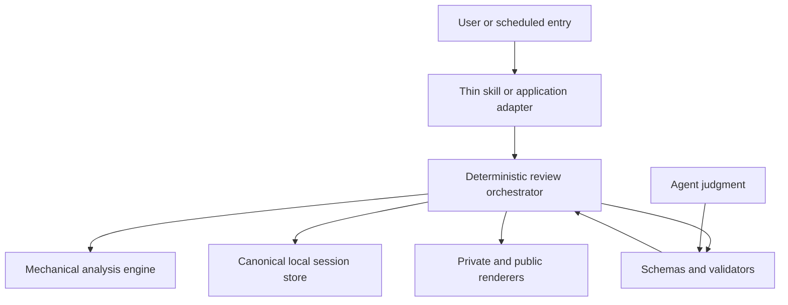

# Research: skill versus agent loop

Decision update: the useful distinction is not "skill or agent." The product needs a deterministic review kernel, a thin reusable skill contract, and optional agent surfaces around the same lifecycle.

## Reframing the question

A skill is an invocation and guidance surface. An agent loop is orchestration, state, tool policy, and recovery. They solve different layers and can coexist.

The failure mode in the earlier architecture was implementing orchestration as a long prose skill:

- the agent had to remember step order
- required questions could be skipped
- numeric facts were copied manually
- state writes could partially succeed
- interrupted runs refetched live data
- public privacy depended on manual redaction

No amount of prompt wording makes those mechanics as reliable as code.

## Target architecture

The agent contributes interpretation, thesis inference, and qualitative framing. Code owns facts, gates, persistence, recovery, and privacy views.

## What remains a skill

- trigger description and product boundary
- single CLI entry point
- route selection guidance
- agent judgment boundaries
- progressive-disclosure links to flow and policy references

The skill should not contain a second renderer, state machine, or long list of conditional disclosures.

## What belongs in orchestration code

- `prepare -> preview -> finalize`
- required question queue and deduplication
- active thesis reconstruction
- evidence and schema validation
- stable session fingerprints
- atomic canonical commit
- idempotent retry and fail-closed conflict handling
- projection repair
- independent public rendering

## Why this preserves analytical quality

Agent flexibility is valuable where the input is ambiguous or contextual:

- brokerage field interpretation
- motive and evidence interpretation
- inferred thesis wording
- qualitative counterfactual and mirror
- observations that may justify another preview

Agent flexibility is harmful where variation has no analytical upside:

- arithmetic
- cycle IDs and rankings
- whether a required question was answered
- whether evidence is complete
- ETF class exemption
- write order and recovery
- privacy redaction

The architecture narrows procedural variance while preserving reasoning variance. Different capable agents may write different narratives from the same facts, but none can silently alter the facts or skip the lifecycle.

## Product surfaces

The same kernel can support:

- an installed coding-agent skill
- a desktop or CLI review flow
- an owner-only research surface
- a future scheduled due-review entry point

Each surface should be a thin adapter. Do not duplicate the review contract for Claude, Codex, Cursor, or a future UI.

## State and privacy

Local state is a product requirement, not an implementation detail. Canonical immutable session bundles support:

- longitudinal rule reconciliation
- append-only thesis evidence
- interruption recovery
- reproducible cards
- deterministic projection repair

Public sharing is another renderer over structured facts, not a cloud synchronization feature and not a redaction pass over private prose.

## Migration stages

### Stage 1: deterministic kernel

Completed in v2: lifecycle, schemas, validation, canonical sessions, recovery, and renderers.

### Stage 2: thin additional entry points

Add only after a real need is validated. Every new entry point must call the same orchestrator and preserve local privacy.

### Stage 3: productized agent application

Consider a dedicated agent runtime only when proactive due reviews, multi-tool coordination, identity/authentication, or commercial distribution require it. The runtime would host the existing kernel; it would not replace it with a new prompt.

## Multi-skill question

A future investment application may expose several clear skills: trade review, thesis capture, due revisit, and research evidence. That is compatible with one agent as long as:

- each skill has a narrow trigger and output
- shared state transitions live in one kernel
- skills cannot bypass the same privacy and recommendation boundaries
- one user task selects a clear route rather than loading every instruction at once

The wrong design is a flat collection of overlapping skills that each writes its own state. The right design is multiple thin capabilities over one state machine.

## Build triggers

Upgrade the runtime only when evidence shows a missing capability:

- users need proactive reminders rather than return-time memory
- a UI must coordinate several authenticated data sources
- the local CLI prevents adoption despite successful card value tests
- operational monitoring or billing becomes necessary

Until then, a thin skill plus deterministic local kernel is the lower-risk architecture.

## Current conclusion

The v2 design is the appropriate release shape: one canonical cross-agent workflow, deterministic validators and session handling, and flexible agent interpretation inside explicit boundaries. The next product risk is not choosing a larger agent framework; it is proving that the reliable card and thesis loop matter to real users.
