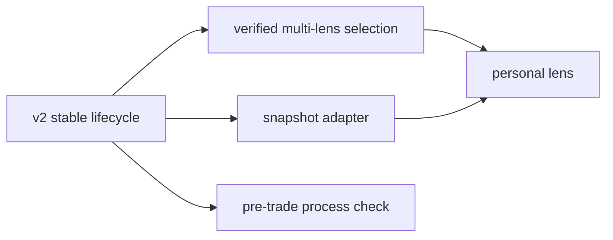

# fomo-kernel roadmap: rule loop and lens loop

This document updates the original June roadmap to reflect the v2.1 snapshot implementation on 2026-07-17.

## Two evolution axes

| Axis | Question | Sequence |
|---|---|---|
| Rule loop | Which behavior should change, and did it change? | first diagnosis -> user-chosen rule -> reconciliation -> graduation |
| Lens loop | Which decision philosophy should frame contextual ambiguity? | verified lens choice -> comparison -> personal synthesis |

The rule loop comes first because lens learning needs repeated reviews. Lenses may change interpretation and language, but they must not fork mechanical facts or persistence.

## Product stages

### v0: stateless card

Delivered the initial one-card behavior diagnosis but could not reconcile progress across sessions.

### v1: local continuity

Implemented local state, append-only theses and rules, prior-commitment reconciliation, and issue tracking. This established that continuity is a first-principles requirement rather than a retention add-on.

### v2: stable orchestrated review

Current P0 release candidate:

- thin skill entry point with route-specific flows
- deterministic Review Plan and required question queue
- evidence-gated thesis decisions
- private/public deterministic rendering
- canonical atomic session bundle and recovery
- ETF allocation versus concentration policy
- English implementation contracts and localized product/GTM copy

Exit criteria are documented in `docs/release-2026-07-19.md`.

### v2.1: initial snapshot onboarding

Delivered after the P0 release-gate scope was frozen:

- local position-table or screenshot transcription into a normalized JSON envelope, with `review.py` as the only runtime engine entry point
- temporary normalized JSON kept outside the repository
- opening portfolio check limited to cost or value weights, single-position risk, driver concentration, ETF structure, and data integrity
- inferred thesis initialization for every uncovered open cycle
- complete initial snapshots may establish an accounting anchor; incomplete snapshots produce a review without becoming an anchor
- transaction-history upgrade path for later supported history-dependent behavioral diagnostics, while ledger-derived current holdings remain canonical and unreconciled current-view claims fail closed
- no engine OCR, cloud upload, agent-calculated weights, or hand-assembled card/state artifacts

Deferred P1 continuation: compare a second or subsequent snapshot with ledger-derived current holdings, show the narrow diff, and emit any explicit adjustment/new anchor without guessing why the mismatch occurred. The initial adapter does not implement this reconciliation contract.

### v2.2: multi-lens P1

- select from a small verified lens set
- compare only where philosophies genuinely diverge
- keep universal behavioral loss mechanisms non-overridable
- preserve one-card convergence

### v3: personal decision system

- distill repeated confirmed preferences into a small personal lens
- improve the lens from real outcomes and error patterns
- connect richer source attribution in the owner workflow
- optionally expose a pre-trade process check

## Dependency graph

## Sequencing principles

1. Reliability and privacy gates precede new interpretation features.
2. A feature may add context but may not create a second fact or state authority.
3. Real-user card usefulness is a release gate separate from owner dogfooding.
4. A new lens requires source verification and a measurable divergence case.
5. A new rule can graduate only when there were real opportunities to violate it and the user confirms the transition.

## Explicit non-goals

- Cloud account or synchronization system.
- Security recommendations or market forecasts.
- A large portfolio governance wiki.
- Several simultaneous active rules.
- A dashboard that replaces the one-card conclusion.
